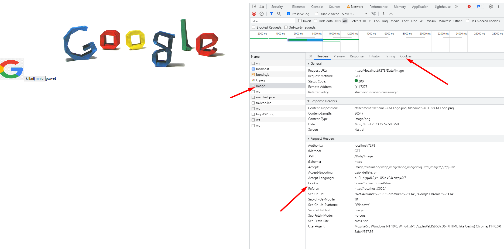

In this webpage I am learning how to send cookie with the request for image.

Page:
- First image is just image placed in the public directory of the react application. It is used as a reference 
- Button is used to call application server. Application server returns a date and it sets cookie
- Second image is image returned by the service from the application server. This is the main element of the page. I want to send cookies with the request for this image. It is cross domain call which makes things difficult.


Solution:

On the react side the main and critical element is `withCredentails` parameter.

```
var response = await axios.get("https://localhost:7278/Date/Get", { withCredentials: true });
```


Check out the [second part](https://github.com/ProductivityTools-Learning/ProductivityTools.Learning.Cookies.WebApi) for the server side.

For the post you can use:

```
 axios.defaults.withCredentials = true;
```